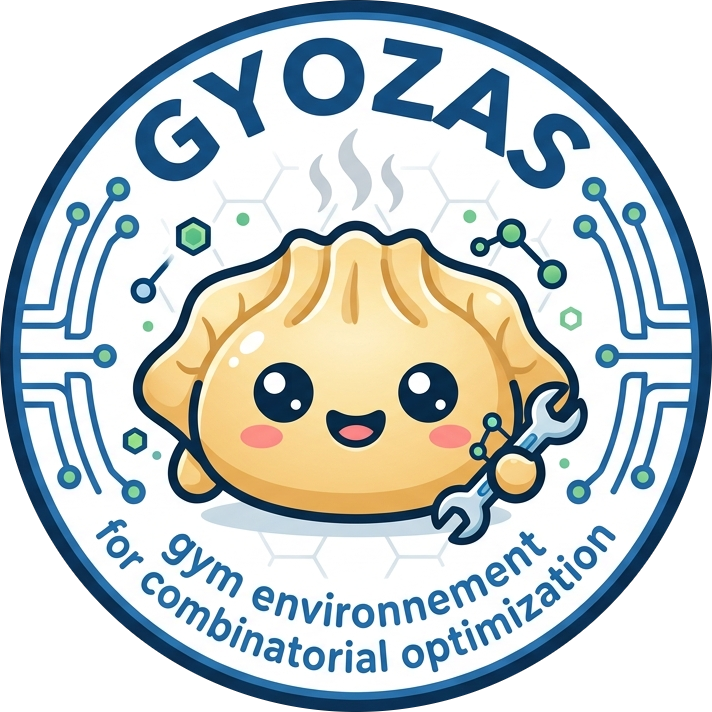

# Gyozas

{: style="width: 30%; display: block; margin: auto;" }

**Pure-Python reinforcement learning for combinatorial optimization.**

Gyozas provides a modular RL environment built on [PySCIPOpt](https://github.com/scipopt/PySCIPOpt) and [Gymnasium](https://gymnasium.farama.org/). It lets you train agents to make decisions inside SCIP's branch-and-bound solver -- variable selection (branching) and node selection -- with pluggable rewards, observations, and problem instance generators.

## Why Gyozas?

- **Pure Python** -- no C++ compilation, just `pip install gyozas`
- **Gymnasium-style API** -- familiar `reset()` / `step()` interface
- **Modular** -- swap dynamics, rewards, observations, and instance generators independently
- **Research-ready** -- bipartite graph observations from [Gasse et al. (NeurIPS 2019)](https://arxiv.org/abs/1906.01629)

## Quick Example

```python
import gyozas

instances = gyozas.SetCoverGenerator(n_rows=100, n_cols=200)

env = gyozas.Environment(
    instance_generator=instances,
    observation_function=gyozas.NodeBipartite(),
    reward_function=gyozas.NNodes(),
)

obs, action_set, reward, done, info = env.reset()
while not done:
    action = action_set[0]  # pick first candidate
    obs, action_set, reward, done, info = env.step(action)

env.close()
```

## Next Steps

- [Getting Started](getting-started.md) -- install SCIP, install gyozas, run your first episode
- [Concepts](concepts.md) -- understand the environment lifecycle, dynamics, rewards, and observations
- [API Reference](api/environment.md) -- full class documentation

## Contributors

| Name | Affiliation | GitHub |
|------|-------------|--------|
| Olivier JUAN | EDF Lab | [@olivierjuan](https://github.com/olivierjuan) |
| Paul STRANG | EDF Lab · CNAM · ISAE | [@abfariah](https://github.com/abfariah) |
